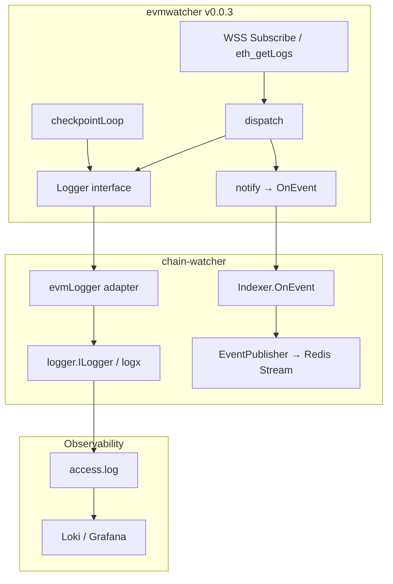

# evmwatcher 重构方案

## 1. 背景与目标

### 1.1 现状

- `chain-watcher` 依赖 `github.com/irvin518/evmwatcher@v0.0.2` 监听链上事件
- evmwatcher 内部使用 `log.Printf` 输出到 **stderr**，不经过 chain-watcher 的 `logger.ILogger` → **access.log → Promtail → Loki**
- staging 曾出现 `BetPlaced` 链上成功但 betting-service 未消费，排查时 chain-watcher 缺少 evmwatcher 层诊断日志

### 1.2 目标

1. **evmwatcher 诊断日志进入 Loki**，与 chain-watcher 其他日志统一查询
2. **修复水位虚推进**：`confirmations=0` 时 `checkpointLoop` 不应按 head 推进水位
3. **补齐静默丢弃日志**：`dispatch` 地址/topic 不匹配时当前无日志
4. **保持库独立性**：evmwatcher 不依赖 polyStock 的 `logger` 包

### 1.3 不在本次范围

- 不改 `StorageInterface` / `EventInterface` 签名
- 不强制所有调用方开启 `confirmations > 0`（默认仍为 0）
- Observer / Prometheus metrics（可选二期）

---

## 2. 方案选型

### 2.1 不推荐：仅通过 error 返回给 chain-watcher 打印

| 场景 | 是否 error | 是否需要日志 |
|------|-----------|-------------|
| `SubscribeFilterLogs` 失败 | ✅ | ✅ |
| `OnEvent` 回调失败 | ✅ | ✅ |
| 地址/topic 不匹配被 `dispatch` 丢弃 | ❌ 静默 return | ✅ **必须 Warn** |
| `checkpointLoop` 无事件推进水位 | ❌ 无 error | ✅ **必须 Info/Warn** |
| backfill 扫到 0 条 log | ❌ 正常 | ✅ Debug/Info |
| 订阅断线恢复 | ❌ 无 error | ✅ Info |
| 收到并投递 `BetPlaced` | ❌ 无 error | ✅ Info |

**结论**：error 只覆盖「需要中断/重试/上报」的失败路径；约 90% 的排查信息属于诊断日志，必须走 Info/Warn/Debug。

### 2.2 推荐：Logger 注入 + chain-watcher 适配器

```
evmwatcher                         chain-watcher
┌─────────────────┐               ┌──────────────────────┐
│ 内部诊断点       │──Logger──────▶│ logger.ILogger       │
│ (Info/Warn/Err) │               │ → access.log         │
└─────────────────┘               │ → Promtail → Loki    │
        │                           └──────────────────────┘
        │ OnEvent (业务)
        └──────────────────────────▶ Indexer.OnEvent / InviteRewardListener.OnEvent
```

**原则**：

- evmwatcher 定义库内最小 `Logger` 接口
- chain-watcher 写 adapter 桥接到现有 `logger.ILogger`
- 业务事件仍走 `EventInterface.OnEvent`，与日志分离
- `OnEvent` 返回的 error 由 evmwatcher **和** chain-watcher **两层**均可打印（不互斥）

### 2.3 可选二期：Observer 回调

```go
type Observer interface {
    OnSubscribed(query FilterSummary)
    OnLogDropped(reason string, log types.Log)
    OnEventDelivered(event *Event)
    OnWatermarkUpdated(block uint64)
    OnError(err error)
}
```

适合后续接 Prometheus；第一版 Logger 足够。

---

## 3. evmwatcher 库改造（`github.com/irvin518/evmwatcher`）

目标版本：**v0.0.3**

### 3.1 新增 Logger 接口

```go
// logger.go
package evmwatcher

type Logger interface {
    Debugf(format string, args ...any)
    Infof(format string, args ...any)
    Warnf(format string, args ...any)
    Errorf(format string, args ...any)
}

type stdLogger struct{ prefix string }

func defaultLogger(chainName string) Logger {
    return stdLogger{prefix: "evmwatcher: [" + chainName + "] "}
}

func (l stdLogger) Debugf(format string, args ...any) {
    log.Printf(l.prefix+format, args...)
}
// Infof / Warnf / Errorf 同理，沿用现有 log.Printf 行为
```

### 3.2 Option 注入

```go
func WithLogger(logger Logger) Option {
    return func(e *EVMWatcher) {
        if logger != nil {
            e.logger = logger
        }
    }
}
```

`EVMWatcher` 结构体新增字段：

```go
type EVMWatcher struct {
    // ...
    logger Logger
}
```

`NewEVMWatcher` 默认：`e.logger = defaultLogger(chainName)`

内部所有 `e.logf(...)` 改为按级别调用 `e.logger.Infof(...)` 等；`logf` 可保留为 `Errorf` 的薄封装以减小 diff。

可选：

```go
func WithDebug(enabled bool) Option  // Debug 级别开关，默认 false
```

### 3.3 必打日志点

#### P0 — 启动 / 订阅（Info）

| 位置 | 日志内容 |
|------|---------|
| `Start()` | `start watcher: head=%d stored=%d startAt=%d confirmations=%d mode=%s` |
| `newWatchTarget()` | 每个事件：`watch event: contract=%s name=%s topic0=%s` |
| `buildQuery()` / `subscribe()` | `filter query: addresses=%v topic0_count=%d` |
| `subscribe()` 成功 | `subscription established` |
| `subscribe()` 失败 | `subscription failed: %v`（Error，并 return error） |

#### P1 — 运行诊断（Info / Warn）

| 位置 | 级别 | 日志内容 |
|------|------|---------|
| `backfill` 每批 | Info | `backfill: from=%d to=%d logs=%d scanned_to=%d` |
| `dispatch` 地址不匹配 | **Warn** | `drop log: reason=unknown_address address=%s topic0=%s block=%d tx=%s` |
| `dispatch` topic 不匹配 | **Warn** | `drop log: reason=unknown_topic0 topic0=%s address=%s block=%d tx=%s` |
| `dispatch` 成功入队 | Info | `dispatch: event=%s block=%d tx=%s log_index=%d` |
| `notify` 成功 | Info | `delivered: event=%s block=%d tx=%s` |
| `checkpointLoop` tick | Info | `checkpoint: head=%d lastBlock=%d deliveredBlock=%d reportedBlock=%d streaming=%v` |
| `resubscribe` 恢复 | Info | `log subscription recovered at block %d`（已有，升为 Info） |

#### P2 — 错误（Error，保留现有逻辑）

- `failed to decode event %s: %v`
- `failed to notify event %s: %v`
- `log subscription broken: %v`
- `failed to resubscribe logs: %v`
- `failed to save watched block number %d: %v`
- `rate limited on scanning [%d, %d]`
- `block range rejected, shrink the range to %d blocks`

#### P3 — 高频（Debug，默认关闭）

- `eventLoop` 每条 raw log：`raw log: block=%d tx=%s topic0=%s`

### 3.4 修复 checkpointLoop 水位 bug（必须）

**问题**（`evmWatcher.go` L425–448）：

`confirmations == 0` 时，`checkpointLoop` 每 2 分钟执行：

```go
e.setLastBlock(head)
e.reportWatermark(head)
```

即使 **未收到任何链上事件**，水位也会随 head 推进，导致 gap 被永久跳过。

**修复**：

```go
case <-ticker.C:
    if !e.isStreaming() {
        continue
    }
    head, err := e.blockNumber(ctx)
    if err != nil {
        e.logger.Errorf("failed to get block number: %v", err)
        continue
    }
    // 只打诊断日志，不按 head 推进水位
    e.logger.Infof("checkpoint tick: head=%d lastBlock=%d delivered=%d reported=%d streaming=%v",
        head, e.getLastBlock(), e.deliveredBlock.Load(), e.reportedBlock, e.isStreaming())
```

**水位推进规则**（修复后）：

| 路径 | 推进方式 |
|------|---------|
| `notify` 成功 | `deliveredBlock` + `reportDelivered` |
| `backfill` 扫描 | `setLastBlock(scanned)` + `reportWatermark(scanned)`（有 backlog 时由 `reportWatermark` 钳制） |
| `checkpointLoop` | **仅诊断，不推进** |
| `Stop` | flush 最终 watermark |

`backfill` 中的 `reportWatermark(scanned)` 在「扫过但无匹配 log」时仍会推进扫描游标，这是预期行为（已扫描的区块不会重复扫）；与「未扫描区块被 head 跳过」是不同问题。

### 3.5 dispatch 静默丢弃改为 Warn

当前代码（L599–615）：

```go
if target == nil {
    return  // 静默
}
if !ok {
    return  // 静默
}
```

改为打 Warn 后 return（注意控制频率：同一 `(address, topic0)` 可加简单 rate limit 或仅 Debug 重复项，避免刷屏）。

### 3.6 不改动的部分

- `StorageInterface` / `EventInterface` 签名
- `confirmations == 0` 的 WSS 订阅 + backfill 主流程
- `confirmations > 0` 的 `confirmationLoop` 逻辑（已实现方案 A）
- 默认行为：`WithLogger` 未传时仍走 `stdLogger` → `log.Printf`

---

## 4. chain-watcher 侧改造

改动量小，主要在 `services/chainWatcher/`。

### 4.1 新增 Logger Adapter

新建 `evmwatcher_logger.go`：

```go
package main

import (
    "fmt"

    "logger"
)

type evmLogger struct {
    log       logger.ILogger
    component string
    chainName string
}

func newEVMLogger(log logger.ILogger, chainName string) *evmLogger {
    return &evmLogger{
        log:       log,
        component: "evmwatcher",
        chainName: chainName,
    }
}

func (l *evmLogger) fields() map[string]interface{} {
    return map[string]interface{}{
        "component":  l.component,
        "chain_name": l.chainName,
    }
}

func (l *evmLogger) Debugf(format string, args ...any) {
    l.log.Debug(fmt.Sprintf(format, args...), l.fields())
}

func (l *evmLogger) Infof(format string, args ...any) {
    l.log.Info(fmt.Sprintf(format, args...), l.fields())
}

func (l *evmLogger) Warnf(format string, args ...any) {
    l.log.Warn(fmt.Sprintf(format, args...), l.fields())
}

func (l *evmLogger) Errorf(format string, args ...any) {
    l.log.Error(fmt.Sprintf(format, args...), l.fields())
}
```

### 4.2 注入 watcher

修改 `watcher_options.go`：

```go
func buildWatcherOptions(cfg IndexerConfig, log logger.ILogger, chainName string) []evmwatcher.Option {
    cfg = cfg.withDefaults()
    opts := []evmwatcher.Option{
        evmwatcher.WithMaxBlockRange(cfg.BatchBlocks),
        evmwatcher.WithRequestInterval(time.Duration(cfg.RequestIntervalMs) * time.Millisecond),
        evmwatcher.WithConfirmations(cfg.Confirmations),
        evmwatcher.WithPollInterval(time.Duration(cfg.PollIntervalSeconds) * time.Second),
        evmwatcher.WithLogger(newEVMLogger(log, chainName)),
    }
    return opts
}
```

修改调用方：

- `indexer.go` → `buildWatcherOptions(indexerCfg, log, chainName)`
- `invite_reward_listener.go` → `buildWatcherOptions(indexerCfg, log, chainName)`

### 4.3 业务层日志（保持现有）

`indexer.go` / `invite_reward_listener.go` 的 `OnEvent` 继续打印业务日志：

- `MarketEscrow on-chain event received`
- `Parsed BetPlaced event`
- `Failed to publish MarketEscrow event`

evmwatcher 打库层（dispatch / subscribe / checkpoint），chain-watcher 打业务层（parse / publish），职责清晰。

### 4.4 配置建议（运维）

staging ConfigMap 当前缺少 `Indexer` 段，`confirmations` 实际为 0。建议在 `config.yaml` 增加：

```yaml
Indexer:
  BatchBlocks: 2000
  RequestIntervalMs: 200
  Confirmations: 12        # 生产/staging 建议 ≥ 12
  PollIntervalSeconds: 3
```

`confirmations > 0` 时走轮询确认模式，语义更清晰，且不依赖 WSS 长连接稳定性。

---

## 5. 架构示意



---

## 6. 实施步骤

| 步骤 | 仓库 | 内容 |
|------|------|------|
| 1 | evmwatcher | 加 `Logger` 接口 + `WithLogger` + 替换 `logf` |
| 2 | evmwatcher | `dispatch` 静默丢弃 → Warn |
| 3 | evmwatcher | 修 `checkpointLoop` 水位逻辑 |
| 4 | evmwatcher | 加 P0/P1 日志点 |
| 5 | evmwatcher | 发版 **v0.0.3** |
| 6 | polyStock | 新增 `evmwatcher_logger.go`，`buildWatcherOptions` 注入 |
| 7 | polyStock | `go.mod` 升级 `github.com/irvin518/evmwatcher v0.0.3` |
| 8 | 运维 | ConfigMap 补 `Indexer.Confirmations`；必要时回退 Redis 水位回补历史 |
| 9 | 验证 | Loki 查询 + staging 下单回归 |

---

## 7. 验收标准

### 7.1 evmwatcher 库

1. 未传 `WithLogger` 时行为与 v0.0.2 一致（stderr `log.Printf`）
2. 传入 `WithLogger` 后，所有原 `logf` 路径走注入 Logger
3. `confirmations == 0`：`checkpointLoop` **不再** `setLastBlock(head)` / `reportWatermark(head)`
4. `dispatch` 丢弃 log 时输出 Warn，含 `address`、`topic0`、`block`、`tx`
5. `Start` / `subscribe` / `backfill` / `resubscribe` 有 Info 级生命周期日志

### 7.2 chain-watcher

1. evmwatcher 日志出现在 access.log，字段含 `component=evmwatcher`、`chain_name`
2. Loki 可查到 `subscription established`、`dispatch: event=BetPlaced`、`checkpoint tick`
3. `Indexer` / `InviteRewardListener` 共用同一 adapter 模式
4. 编译通过，现有 `OnEvent` 业务日志不变

### 7.3 联调场景

| 场景 | 期望日志 |
|------|---------|
| 服务启动 | `start watcher`、`watch event`、`subscription established` |
| 下单链上 BetPlaced | evmwatcher `dispatch` + chain-watcher `on-chain event received` + `published to Redis Stream` |
| WSS 断线 | `log subscription broken` → `log subscription recovered` |
| 错误合约地址配置 | `drop log: reason=unknown_address` 或启动期 ABI 报错 |
| 无事件运行 2 分钟 | `checkpoint tick`，Redis 水位 **不** 随 head 疯涨 |

---

## 8. Loki 查询示例

namespace 以 `polystock-staging` 为例（实际以环境为准）：

```logql
# evmwatcher 订阅建立
{namespace="polystock-staging", app="chain-watcher"} |= "subscription established"

# 静默丢弃（改造后应可见）
{namespace="polystock-staging", app="chain-watcher"} |= "drop log"

# 库层投递
{namespace="polystock-staging", app="chain-watcher"} |= "dispatch: event=BetPlaced"

# checkpoint 诊断（不应再虚推进水位）
{namespace="polystock-staging", app="chain-watcher"} |= "checkpoint tick"

# 业务层完整链路
{namespace="polystock-staging", app="chain-watcher"} |= "on-chain event received"

# 订阅断线恢复
{namespace="polystock-staging", app="chain-watcher"} |~ "subscription broken|subscription recovered"
```

配合 betting-service：

```logql
{namespace="polystock-staging", app="betting-service"} |= "STALE_PENDING_BUY_ORDER"
```

---

## 9. 相关文件

| 文件 | 说明 |
|------|------|
| `github.com/irvin518/evmwatcher` | 独立库，本方案主要改动点 |
| `services/chainWatcher/watcher_options.go` | 注入 `WithLogger` |
| `services/chainWatcher/indexer.go` | MarketEscrow watcher + 业务 OnEvent |
| `services/chainWatcher/invite_reward_listener.go` | InviteReward watcher |
| `services/chainWatcher/block_storage.go` | Redis 水位 `chainwatcher:watched_block:<chain>` |
| `services/chainWatcher/config.go` | `IndexerConfig`（Confirmations 等） |
| `services/chainWatcher/LOGX_INTEGRATION.md` | chain-watcher 日志链路说明 |
| `.cursor/skills/loki-logs/SKILL.md` | Loki 查询技能 |

---

## 10. 总结

| 方案 | 评价 |
|------|------|
| 只返回 error 给 chain-watcher | ❌ 不够，大量诊断不是 error |
| evmwatcher 内部 `log.Printf` | ❌ 进不了 Loki |
| **Logger 注入 + chain-watcher 适配** | ✅ **推荐** |
| 修 `checkpointLoop` 水位 bug | ✅ **必须与日志改造同期发布** |
| Observer 回调 | ✅ 可选二期 |

**核心结论**：日志应在 chain-watcher 侧统一落盘（通过注入 Logger），而不是把所有信息塞进 error 返回值。error 负责失败传播；Info/Warn/Debug 负责可观测性与故障排查。
